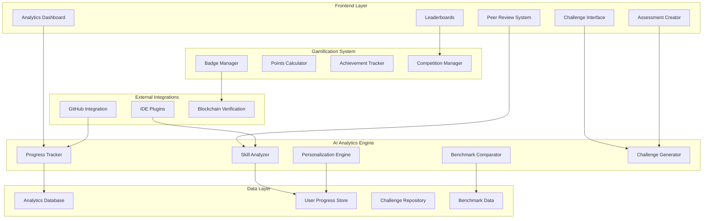

# Advanced Learning Analytics & Gamification System Design

## Overview

The Advanced Learning Analytics & Gamification System transforms KiroVerse from a simple feedback tool into a comprehensive learning platform with sophisticated analytics, skill progression tracking, and competitive elements. This system leverages AI orchestration, blockchain verification, and data analytics to provide measurable learning outcomes and engaging social features.

The design builds upon KiroVerse's existing AI-powered mentorship and blockchain credentials foundation, extending it with advanced analytics capabilities, gamification elements, and collaborative learning features that demonstrate the platform's educational value to both learners and employers.

## Architecture

### High-Level System Architecture



### Data Flow Architecture

The system processes code submissions through multiple analysis pipelines:

1. **Real-time Analysis**: Immediate feedback during coding sessions
2. **Batch Processing**: Comprehensive skill analysis and trend identification
3. **Comparative Analysis**: Benchmarking against peers and industry standards
4. **Predictive Analytics**: Learning path recommendations and career guidance

## Components and Interfaces

### Analytics Dashboard Component

**Purpose**: Provides comprehensive visualization of learning progress and skill development

**Key Features**:
- Interactive skill progression charts using D3.js or Chart.js
- Personalized learning insights and recommendations
- Industry benchmark comparisons
- Achievement timeline and milestone tracking

**Interface Design**:
```typescript
interface AnalyticsDashboard {
  userId: string;
  skillProgression: SkillProgressData[];
  learningInsights: LearningInsight[];
  benchmarkComparisons: BenchmarkData[];
  achievements: Achievement[];
}

interface SkillProgressData {
  skillId: string;
  skillName: string;
  progressHistory: ProgressPoint[];
  currentLevel: number;
  trendDirection: 'improving' | 'stable' | 'declining';
}
```

### Challenge System Component

**Purpose**: Manages coding challenges, competitions, and peer interactions

**Key Features**:
- AI-generated challenges based on skill level and learning goals
- Real-time leaderboards with privacy-preserving rankings
- Peer review and mentorship facilitation
- Custom assessment creation for employers

**Design Rationale**: The challenge system uses AI to generate personalized challenges that adapt to user skill level, ensuring optimal learning difficulty. The leaderboard system maintains engagement while protecting user privacy through anonymized comparisons.

### Skill Assessment Engine

**Purpose**: Analyzes code quality, tracks skill development, and provides intelligent feedback

**Key Features**:
- Multi-dimensional skill analysis (code quality, efficiency, creativity, best practices)
- Learning pattern recognition and adaptation
- Personalized feedback generation
- Integration with existing AI mentorship system

**Integration Strategy**: Extends the existing Genkit-based AI flows to include advanced analytics capabilities while maintaining the Socratic teaching methodology.

### Blockchain Verification System

**Purpose**: Provides tamper-proof credential verification and achievement tracking

**Key Features**:
- Enhanced NFT badges with detailed skill metadata
- Verification links for employer validation
- Achievement rarity and authenticity tracking
- Integration with existing Sepolia testnet infrastructure

## Data Models

### User Progress Model

```typescript
interface UserProgress {
  userId: string;
  skillLevels: Map<string, SkillLevel>;
  learningVelocity: number;
  codeQualityTrend: TrendData;
  challengesCompleted: Challenge[];
  peerInteractions: PeerInteraction[];
  lastAnalysisDate: Date;
}

interface SkillLevel {
  skillId: string;
  currentLevel: number;
  experiencePoints: number;
  competencyAreas: CompetencyArea[];
  industryBenchmark: BenchmarkScore;
  verificationStatus: 'verified' | 'pending' | 'unverified';
}
```

### Analytics Data Model

```typescript
interface AnalyticsData {
  sessionId: string;
  userId: string;
  codeSubmission: CodeSubmission;
  aiAnalysis: AIAnalysisResult;
  skillImprovements: SkillImprovement[];
  learningInsights: LearningInsight[];
  benchmarkComparisons: BenchmarkComparison[];
  timestamp: Date;
}

interface LearningInsight {
  type: 'strength' | 'improvement_area' | 'recommendation';
  category: string;
  description: string;
  actionableSteps: string[];
  confidenceScore: number;
}
```

### Challenge and Competition Model

```typescript
interface Challenge {
  challengeId: string;
  title: string;
  description: string;
  difficulty: 'beginner' | 'intermediate' | 'advanced' | 'expert';
  skillsTargeted: string[];
  timeLimit?: number;
  evaluationCriteria: EvaluationCriteria[];
  createdBy: 'ai' | 'community' | 'employer';
  isActive: boolean;
}

interface Competition {
  competitionId: string;
  type: 'daily' | 'weekly' | 'monthly' | 'special';
  participants: Participant[];
  leaderboard: LeaderboardEntry[];
  prizes: Prize[];
  startDate: Date;
  endDate: Date;
}
```

## Error Handling

### Analytics Processing Errors

**Strategy**: Implement graceful degradation when analytics processing fails
- Fallback to basic progress tracking if advanced analytics are unavailable
- Queue failed analyses for retry processing
- Provide user notifications about temporary service limitations

### Blockchain Verification Failures

**Strategy**: Maintain local verification while blockchain is unavailable
- Store pending verifications in local database
- Retry blockchain operations with exponential backoff
- Provide clear status indicators for verification states

### AI Analysis Failures

**Strategy**: Ensure core functionality remains available
- Use cached analysis results when real-time analysis fails
- Provide basic feedback when advanced AI analysis is unavailable
- Implement circuit breaker pattern for AI service calls

## Testing Strategy

### Unit Testing

**Focus Areas**:
- Skill progression calculation algorithms
- Analytics data processing functions
- Challenge generation and evaluation logic
- Blockchain interaction components

**Tools**: Jest for JavaScript/TypeScript testing, with comprehensive mocking of external services

### Integration Testing

**Focus Areas**:
- AI flow integration with analytics system
- Database operations and data consistency
- Blockchain verification workflows
- External API integrations (GitHub, IDE plugins)

**Approach**: Use test databases and blockchain testnets to simulate real-world conditions

### Performance Testing

**Key Metrics**:
- Analytics dashboard load time (target: < 3 seconds)
- Real-time feedback response time (target: < 2 seconds)
- Challenge generation time (target: < 5 seconds)
- Concurrent user handling capacity

**Tools**: Load testing with realistic user scenarios and data volumes

### User Experience Testing

**Focus Areas**:
- Analytics dashboard usability and comprehension
- Challenge difficulty progression and engagement
- Peer interaction workflows
- Employer assessment creation process

**Approach**: A/B testing for key user flows, accessibility compliance testing, and user feedback integration

## Security and Privacy Considerations

### Data Protection

**User Code Privacy**: Implement end-to-end encryption for code submissions and ensure secure storage with access controls

**Analytics Data**: Anonymize personal identifiers in analytics processing while maintaining learning effectiveness

**Peer Interactions**: Provide privacy controls for peer review participation and mentorship visibility

### Blockchain Security

**Credential Integrity**: Ensure NFT metadata cannot be manipulated and verification links remain valid

**Wallet Security**: Maintain secure server-side wallet operations with proper key management

### Performance Optimization

**Caching Strategy**: Implement intelligent caching for analytics data, benchmark comparisons, and challenge content

**Database Optimization**: Use appropriate indexing for analytics queries and implement data archiving for historical data

**AI Processing**: Optimize AI model calls through batching and result caching where appropriate

This design provides a comprehensive foundation for implementing the Advanced Learning Analytics & Gamification System while maintaining integration with KiroVerse's existing architecture and principles.