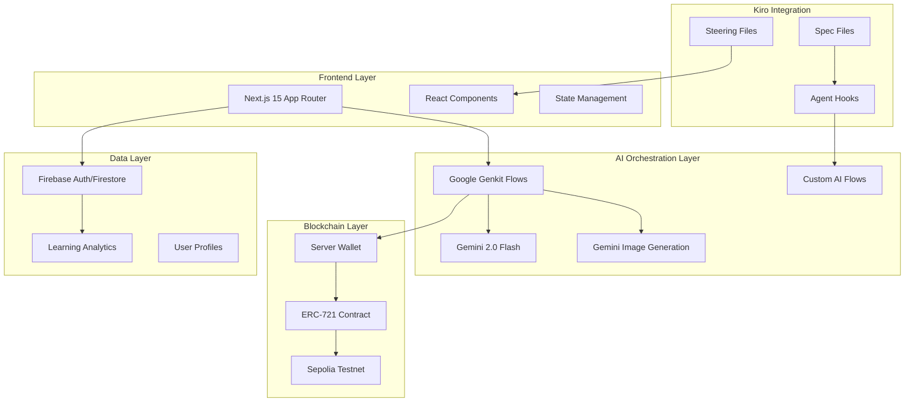

# Design Document

## Overview

SkillVerse is architected as a sophisticated multi-layered platform that showcases the full power of Kiro's spec-driven development methodology. The platform integrates advanced AI orchestration, real blockchain functionality, and comprehensive user experience design to create a unique learning environment. This design demonstrates how Kiro enables the development of complex, production-ready applications through systematic specification, intelligent agent coordination, and automated development workflows.

## Architecture

### High-Level System Architecture



### Kiro-Driven Development Architecture

The platform demonstrates Kiro's spec-driven methodology through:

1. **Comprehensive Specifications**: Each feature has complete requirements, design, and task specifications
2. **Agent Hook Orchestration**: Complex multi-step workflows automated through Kiro agents
3. **Steering-Guided Development**: Project-wide standards and patterns enforced through steering files
4. **Transparent Development**: Users can see the actual specs that guided platform development

## Components and Interfaces

### Core Application Components

#### 1. SkillVerse Main Application (`KiroApp.tsx`)
```typescript
interface SkillVerseAppProps {
  user: User | null;
  demoMode: boolean;
  onModeToggle: () => void;
}

// Orchestrates the entire platform experience
// Demonstrates component composition and state management
// Shows integration of multiple complex features
```

#### 2. AI-Powered Code Analysis System
```typescript
interface CodeAnalysisFlow {
  analyzeCode: (code: string, language: string) => Promise<CodeFeedback>;
  detectSkills: (code: string) => Promise<Skill[]>;
  generateFeedback: (analysis: CodeAnalysis) => Promise<string>;
}

// Powered by Google Genkit flows
// Demonstrates sophisticated AI orchestration
// Shows structured input/output with Zod validation
```

#### 3. Blockchain Credential System
```typescript
interface BadgeSystem {
  mintBadge: (skill: Skill, userId: string) => Promise<Transaction>;
  generateBadgeIcon: (skill: Skill) => Promise<string>;
  verifyBadge: (tokenId: string) => Promise<BadgeVerification>;
}

// Real NFT minting on Sepolia testnet
// Demonstrates blockchain integration complexity
// Shows multimodal AI for badge artwork generation
```

#### 4. Learning Analytics Engine
```typescript
interface AnalyticsSystem {
  trackProgress: (userId: string, activity: Activity) => Promise<void>;
  generateInsights: (userId: string) => Promise<LearningInsights>;
  comparePeers: (userId: string) => Promise<BenchmarkData>;
}

// Advanced data processing and visualization
// Demonstrates complex state management
// Shows personalized AI recommendations
```

### AI Flow Architecture

#### Primary Genkit Flows

1. **Code Feedback Flow** (`send-chat-message.ts`)
   - Input: User code + context
   - Processing: Gemini 2.0 Flash analysis
   - Output: Structured educational feedback
   - Error Handling: Graceful degradation with user-friendly messages

2. **Skill Badge Flow** (`award-skill-badge.ts`)
   - Input: Code analysis results
   - Processing: Skill detection + badge generation + blockchain minting
   - Output: NFT transaction hash + badge metadata
   - Integration: Multimodal AI for unique badge artwork

3. **Learning Analytics Flow** (New)
   - Input: User activity data
   - Processing: Progress analysis + peer comparison + recommendation generation
   - Output: Personalized learning insights and next steps

4. **Assessment Generation Flow** (New)
   - Input: Job requirements + difficulty level
   - Processing: AI-generated coding challenges
   - Output: Custom assessments with evaluation criteria

### Agent Hook Orchestration

#### Badge Generation Hook (`badge-generation-hook.md`)
```yaml
name: "Advanced Badge Generation"
trigger: "skill_detected"
workflow:
  - step: "analyze_skill_complexity"
    agent: "skill-analysis-agent"
  - step: "generate_unique_artwork" 
    agent: "multimodal-ai-agent"
  - step: "mint_blockchain_badge"
    agent: "blockchain-agent"
  - step: "update_user_profile"
    agent: "data-management-agent"
  - step: "notify_user"
    agent: "notification-agent"
```

This demonstrates:
- Multi-agent coordination
- Complex workflow orchestration
- Real-world blockchain integration
- Error handling across multiple systems

## Data Models

### User Profile Schema
```typescript
interface UserProfile {
  id: string;
  email: string;
  displayName: string;
  createdAt: Date;
  
  // Learning Progress
  skillBadges: SkillBadge[];
  learningAnalytics: LearningAnalytics;
  progressMetrics: ProgressMetrics;
  
  // Social Features
  peerConnections: string[];
  mentorshipStatus: MentorshipStatus;
  
  // Integration Data
  githubProfile?: GitHubIntegration;
  linkedinProfile?: LinkedInIntegration;
}
```

### Skill Badge Schema
```typescript
interface SkillBadge {
  id: string;
  skillName: string;
  skillCategory: SkillCategory;
  difficultyLevel: DifficultyLevel;
  
  // Blockchain Data
  tokenId: string;
  contractAddress: string;
  transactionHash: string;
  blockNumber: number;
  
  // AI-Generated Content
  badgeIcon: string; // Base64 encoded image
  description: string;
  
  // Verification Data
  codeSubmission: string;
  aiAnalysis: CodeAnalysis;
  earnedAt: Date;
}
```

### Learning Analytics Schema
```typescript
interface LearningAnalytics {
  userId: string;
  
  // Progress Tracking
  skillProgression: SkillProgression[];
  codeQualityTrends: QualityMetric[];
  learningVelocity: VelocityMetric[];
  
  // Comparative Data
  peerBenchmarks: BenchmarkData;
  industryComparison: IndustryMetrics;
  
  // AI Insights
  personalizedRecommendations: Recommendation[];
  learningPathSuggestions: LearningPath[];
  nextMilestones: Milestone[];
}
```

## Error Handling

### Comprehensive Error Management Strategy

#### 1. AI Service Failures
```typescript
// Graceful degradation for AI services
const handleAIError = (error: AIError) => {
  switch (error.type) {
    case 'RATE_LIMIT':
      return showRetryMessage();
    case 'SERVICE_UNAVAILABLE':
      return showOfflineMode();
    case 'INVALID_INPUT':
      return showInputGuidance();
    default:
      return showGenericError();
  }
};
```

#### 2. Blockchain Transaction Failures
```typescript
// Robust blockchain error handling
const handleBlockchainError = (error: BlockchainError) => {
  if (error.code === 'INSUFFICIENT_FUNDS') {
    return switchToDemoMode();
  }
  if (error.code === 'NETWORK_CONGESTION') {
    return queueForRetry();
  }
  return logErrorAndNotifyUser(error);
};
```

#### 3. User Experience Error Boundaries
```typescript
// React Error Boundaries for component failures
class SkillVerseErrorBoundary extends React.Component {
  // Prevents entire app crashes
  // Provides helpful error messages
  // Maintains user session and data
}
```

## Testing Strategy

### Multi-Layer Testing Approach

#### 1. AI Flow Testing
```typescript
describe('Code Analysis Flows', () => {
  test('should analyze JavaScript code correctly', async () => {
    const result = await analyzeCodeFlow(sampleJSCode);
    expect(result.skills).toContain('async-programming');
    expect(result.feedback).toBeDefined();
  });
  
  test('should handle malformed code gracefully', async () => {
    const result = await analyzeCodeFlow(malformedCode);
    expect(result.error).toBeDefined();
    expect(result.suggestions).toBeDefined();
  });
});
```

#### 2. Blockchain Integration Testing
```typescript
describe('Badge Minting System', () => {
  test('should mint badge on Sepolia testnet', async () => {
    const transaction = await mintSkillBadge(mockSkill, testUser);
    expect(transaction.hash).toBeDefined();
    expect(transaction.blockNumber).toBeGreaterThan(0);
  });
  
  test('should handle network failures', async () => {
    // Test with network disconnected
    const result = await mintSkillBadge(mockSkill, testUser);
    expect(result.demoMode).toBe(true);
  });
});
```

#### 3. User Experience Testing
```typescript
describe('Platform Integration', () => {
  test('should provide seamless demo mode toggle', async () => {
    const { getByTestId } = render(<SkillVerseApp />);
    const toggle = getByTestId('demo-mode-toggle');
    
    fireEvent.click(toggle);
    expect(screen.getByText('Demo Mode Active')).toBeInTheDocument();
  });
});
```

### Performance Testing
- AI response time targets: < 5 seconds
- Blockchain transaction monitoring
- Component rendering optimization
- Memory usage tracking

## Kiro Integration Showcase

### Spec-Driven Development Demonstration

#### 1. Transparent Development Process
```markdown
# Users can see the actual development specs
/.kiro/specs/skillverse-platform/
├── requirements.md    # This document
├── design.md         # Current document  
└── tasks.md          # Implementation roadmap

# Shows how Kiro guided every development decision
```

#### 2. Agent Hook Sophistication
```yaml
# Complex multi-agent workflows
badge-generation-hook:
  - AI skill detection
  - Multimodal image generation
  - Blockchain transaction execution
  - Data persistence
  - User notification

# Demonstrates advanced Kiro capabilities
```

#### 3. Steering File Integration
```markdown
# Project-wide standards enforcement
/.kiro/steering/skillverse-context.md
- TypeScript best practices
- Component architecture patterns
- AI integration standards
- Blockchain security requirements
```

### Advanced Kiro Features Utilized

1. **Multi-Spec Coordination**: Platform integrates multiple feature specs
2. **Agent Orchestration**: Complex workflows spanning multiple systems
3. **Genkit Integration**: Sophisticated AI flow management
4. **Error Handling**: Comprehensive error management across all layers
5. **Performance Optimization**: Efficient resource usage and caching

## Security Considerations

### Multi-Layer Security Architecture

#### 1. Authentication & Authorization
- Firebase Authentication for user management
- JWT token validation for API access
- Role-based access control for admin features

#### 2. Blockchain Security
- Server-side wallet management (private keys never exposed)
- Transaction validation and gas limit protection
- Smart contract security best practices

#### 3. AI Security
- Input sanitization for code analysis
- Rate limiting for AI API calls
- Structured output validation with Zod schemas

#### 4. Data Protection
- Encryption at rest for sensitive user data
- HTTPS enforcement for all communications
- GDPR compliance for user privacy

## Scalability Design

### Horizontal Scaling Architecture

#### 1. Microservices Approach
- Separate services for AI, blockchain, and data management
- Independent scaling based on demand
- Load balancing across service instances

#### 2. Caching Strategy
- Redis for session management
- CDN for static assets and badge images
- Database query optimization

#### 3. Performance Monitoring
- Real-time metrics for AI response times
- Blockchain transaction monitoring
- User experience analytics

This design demonstrates how Kiro enables the development of sophisticated, production-ready applications through systematic specification, intelligent automation, and comprehensive error handling while maintaining educational transparency throughout the development process.